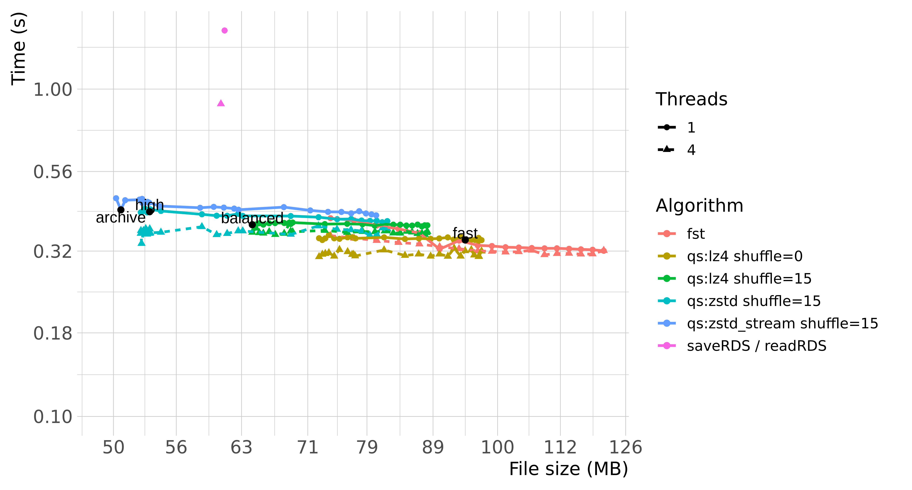
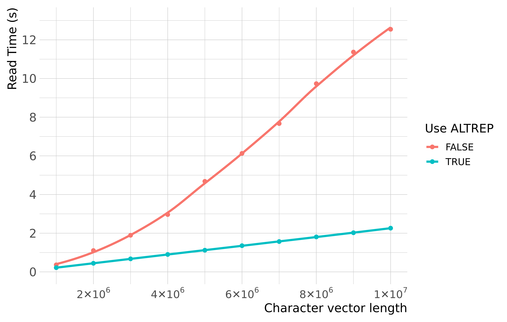

Using qs
================

<!--  -->

<!-- [](https://travis-ci.org/traversc/qs) -->

[](https://github.com/traversc/qs/actions)
[](https://cran.r-project.org/package=qs)
[](https://cran.r-project.org/package=qs)
[](https://cran.r-project.org/package=qs)

*Quick serialization of R objects*

`qs` provides an interface for quickly saving and reading objects to and
from disk. The goal of this package is to provide a lightning-fast and
complete replacement for the `saveRDS` and `readRDS` functions in R.

Inspired by the `fst` package, `qs` uses a similar block-compression
design using either the `lz4` or `zstd` compression libraries. It
differs in that it applies a more general approach for attributes and
object references.

`saveRDS` and `readRDS` are the standard for serialization of R data,
but these functions are not optimized for speed. On the other hand,
`fst` is extremely fast, but only works on `data.frame`’s and certain
column types.

`qs` is both extremely fast and general: it can serialize any R object
like `saveRDS` and is just as fast and sometimes faster than `fst`.

## Usage

``` r
library(qs)
df1 <- data.frame(x=rnorm(5e6), y=sample(5e6), z=sample(letters,5e6, replace=T))
qsave(df1, "myfile.qs")
df2 <- qread("myfile.qs")
```

## Installation

``` r
# CRAN version
install.packages("qs")

# CRAN version compile from source (recommended)
remotes::install_cran("qs", type="source", configure.args="--with-simd=AVX2")

# For earlier versions of R <= 3.4
remotes::install_github("traversc/qs@legacy")
```

## Features

The table below compares the features of different serialization
approaches in R.

|                      | qs |        fst         | saveRDS |
| -------------------- | :-: | :----------------: | :-----: |
| Not Slow             | ✔  |         ✔          |    ❌    |
| Numeric Vectors      | ✔  |         ✔          |    ✔    |
| Integer Vectors      | ✔  |         ✔          |    ✔    |
| Logical Vectors      | ✔  |         ✔          |    ✔    |
| Character Vectors    | ✔  |         ✔          |    ✔    |
| Character Encoding   | ✔  | (vector-wide only) |    ✔    |
| Complex Vectors      | ✔  |         ❌          |    ✔    |
| Data.Frames          | ✔  |         ✔          |    ✔    |
| On disk row access   | ❌  |         ✔          |    ❌    |
| Random column access | ❌  |         ✔          |    ❌    |
| Attributes           | ✔  |        Some        |    ✔    |
| Lists / Nested Lists | ✔  |         ❌          |    ✔    |
| Multi-threaded       | ✔  |         ✔          |    ❌    |

`qs` also includes a number of advanced features:

  - For character vectors, qs also has the option of using the new
    ALTREP system (R version 3.5+) to quickly read in string data.
  - For numerical data (numeric, integer, logical and complex vectors)
    `qs` implements byte shuffling filters (adopted from the Blosc
    meta-compression library). These filters utilize extended CPU
    instruction sets (either SSE2 or AVX2).
  - `qs` also efficiently serializes S4 objects, environments, and other
    complex objects.

These features have the possibility of additionally increasing
performance by orders of magnitude, for certain types of data. See
sections below for more details.

## Summary Benchmarks

The following benchmarks were performed comparing `qs`, `fst` and
`saveRDS`/`readRDS` in base R for serializing and de-serializing a
medium sized `data.frame` with 5 million rows (approximately 115 Mb in
memory):

``` r
data.frame(a=rnorm(5e6), 
           b=rpois(5e6,100),
           c=sample(starnames$IAU,5e6,T),
           d=sample(state.name,5e6,T),
           stringsAsFactors = F)
```

`qs` is highly parameterized and can be tuned by the user to extract as
much speed and compression as possible, if desired. For simplicity, `qs`
comes with 4 presets, which trades speed and compression ratio: “fast”,
“balanced”, “high” and “archive”.

The plots below summarize the performance of `saveRDS`, `qs` and `fst`
with various parameters:

<!-- TO DO: update table with uncompressed saveRDS, qsave for latest version -->

<!-- ### Summary table -->

<!-- ```{r echo=FALSE} -->

<!-- df <- read.csv("df_bench_summary.csv", check.names=F, stringsAsFactors=F) -->

<!-- df$`Write Time (s)` <- signif(df$`Write Time (s)`, 3) -->

<!-- df$`Read Time (s)` <- signif(df$`Read Time (s)`, 3) -->

<!-- df$`File Size (Mb)` <- signif(df$`File Size (Mb)`, 3) -->

<!-- knitr::kable(df) -->

<!-- ``` -->

### Serializing


### De-serializing



*(Benchmarks are based on `qs` ver. 0.21.2, `fst` ver. 0.9.0 and R
3.6.1.)*

Benchmarking write and read speed is a bit tricky and depends highly on
a number of factors, such as operating system, the hardware being run
on, the distribution of the data, or even the state of the R instance.
Reading data is also further subjected to various hardware and software
memory caches.

Generally speaking, `qs` and `fst` are considerably faster than
`saveRDS` regardless of using single threaded or multi-threaded
compression. `qs` also manages to achieve superior compression ratio
through various optimizations (e.g. see “Byte Shuffle” section below).

## ALTREP character vectors

The ALTREP system (new as of R 3.5.0) allows package developers to
represent R objects using their own custom memory layout. This allows a
potentially large speedup in processing certain types of data.

In `qs`, `ALTREP` character vectors are implemented via the
[`stringfish`](https://github.com/traversc/stringfish) package and can
be used by setting `use_alt_rep=TRUE` in the `qread` function. The
benchmark below shows the time it takes to `qread` several million
random strings (nchar = 80) with and without `ALTREP`.



The large speedup demonstrates why one would want to consider the
system, but there are caveats. Downstream processing functions must be
`ALTREP`-aware. See the
[`stringfish`](https://github.com/traversc/stringfish) package for more
details.

## Byte Shuffle

Byte shuffling (adopted from the Blosc meta-compression library) is a
way of re-organizing data to be more ammenable to compression. An
integer contains four bytes and the limits of an integer in R are +/-
2^31-1. However, most real data doesn’t use anywhere near the range of
possible integer values. For example, if the data were representing
percentages, 0% to 100%, the first three bytes would be unused and zero.

Byte shuffling rearranges the data such that all of the first bytes are
blocked together, the second bytes are blocked together, and so on This
procedure often makes it very easy for compression algorithms to find
repeated patterns and can often improves compression ratio by orders of
magnitude. In the example below, shuffle compression achieves a
compression ratio of over 1000x. See `?qsave` for more details.

``` r
# With byte shuffling
x <- 1:1e8
qsave(x, "mydat.qs", preset="custom", shuffle_control=15, algorithm="zstd")
cat( "Compression Ratio: ", as.numeric(object.size(x)) / file.info("mydat.qs")$size, "\n" )
# Compression Ratio:  1389.164

# Without byte shuffling
x <- 1:1e8
qsave(x, "mydat.qs", preset="custom", shuffle_control=0, algorithm="zstd")
cat( "Compression Ratio: ", as.numeric(object.size(x)) / file.info("mydat.qs")$size, "\n" )
# Compression Ratio:  1.479294 
```

## Serializing to memory

You can use `qs` to directly serialize objects to memory.

Example:

``` r
library(qs)
x <- qserialize(c(1,2,3))
qdeserialize(x)
[1] 1 2 3
```

## Serializing objects to ASCII

The `qs` package includes two sets of utility functions for converting
binary data to ASCII:

  - `base85_encode` and `base85_decode`
  - `base91_encode` and `base91_decode`

These functions are similar to base64 encoding functions found in
various packages, but offer greater efficiency.

Example:

``` r
enc <- base91_encode(qserialize(datasets::mtcars, preset = "custom", compress_level = 22))
dec <- qdeserialize(base91_decode(enc))
```

(Note: base91 strings contain double quote characters (`"`) and need to
be single quoted if stored as a string.)

See the help files for additional details and history behind these
algorithms.

## Using qs within Rcpp

`qs` functions can be called directly within C++ code via Rcpp.

Example C++ script:

    // [[Rcpp::depends(qs)]]
    #include <Rcpp.h>
    #include <qs.h>
    using namespace Rcpp;
    
    // [[Rcpp::export]]
    void test() {
      qs::qsave(IntegerVector::create(1,2,3), "/tmp/myfile.qs", "high", "zstd", 1, 15, true, 1);
    }

R side:

``` r
library(qs)
library(Rcpp)
sourceCpp("test.cpp")
# save file using Rcpp interface
test()
# read in file create through Rcpp interface
qread("/tmp/myfile.qs")
[1] 1 2 3
```

The C++ functions do not have default parameters; all parameters must be
specified.

## Future developments

  - Additional compression algorithms
  - Improved ALTREP serialization
  - Re-write of multithreading code
  - Mac M1 optimizations (NEON) and checking

Future versions will be backwards compatible with the current version.
